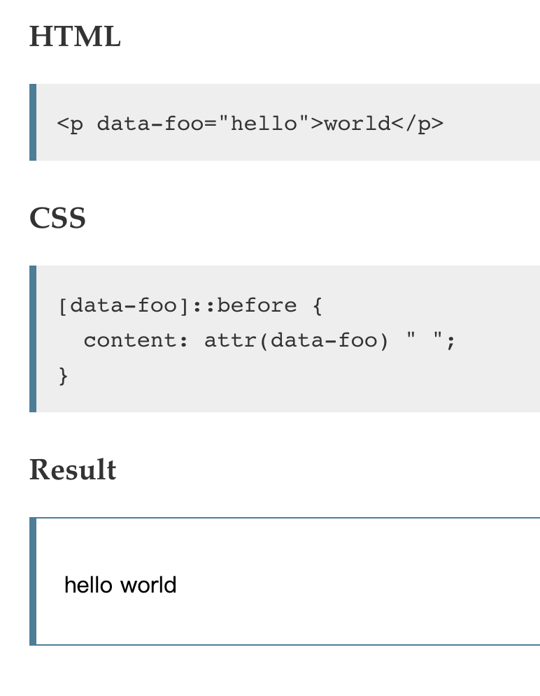

**[html]** html的元素有哪些（包含H5）？

**[css]** CSS3有哪些新增的特性？

**[js]** 写一个方法去掉字符串中的空格 要求能去掉不同类型的：前、后、前后、中间的空格

###回答

#####问题1
2. 块级标签 `<div>` `<p>`  `<header>`  `<footer>`  `<section>` `<table>` `<th>` `<tr>` `<li>` `<ul>` `<hr>`
3. 行内标签 `<span>` `<i>`  `<b>`  `<td>` `<br>` `<button>` `<input>`

#####问题2
1. animate动画
2. transition过渡动画
3. opacity属性  rgba()表达式
4. 完善了很多伪类，例如： `:checked`, `:disabled`, 常用的有`:first-of-type`, `:last-of-type`, `:first-child`, `:last-child`, `:nth-child(n)`等等
5. 伪元素和伪类区分开，伪元素由两个冒号替代，例如： `:after`变为`::after`
6. 完善媒体查询能力
7. background-size
8. border-radius
9. box-shadow
10. box-sizing
11. text-overflow
10. 定义了相对字体大小单位`rem`, 定义了相对视口大小单位`vw`,`vh`
11. 定义了函数符号`calc()`
12. `display: flex;`
13. @规则 `@supports`

#####问题3
```javascript
function trim(str, type){
    if(typeof str !== 'string') throw '请输入字符串';
    switch(type) {
        case 'all':
            return str.replace(/\s/g, '');
        case 'begin':
            return str.replace(/^\s+/, '');
        case 'end':
            return str.replace(/\s+$/, '');
        case 'center':
            var result;
            str.replace(/(^\s+)(.+)(\s+$)/g, ($0, $1, $2) => {
                result =  $0 + $1.replace(/\s/g, '') + $2
            });
            return result;
    }
    
}

```

###tips
>1. 媒体查询并非仅能用于 CSS 文档中，它也被用于 HTML 元素的某些属性中， 例如 <link> 元素的 media 属性
>2. 