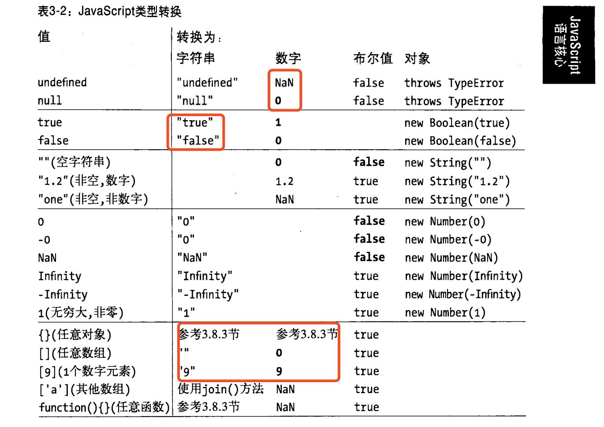
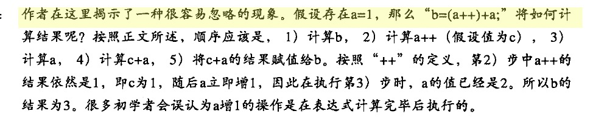
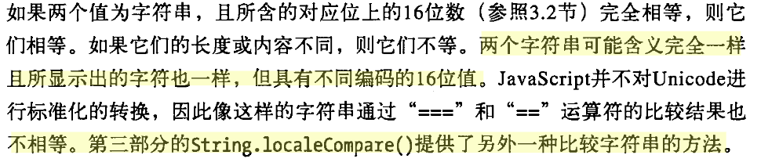
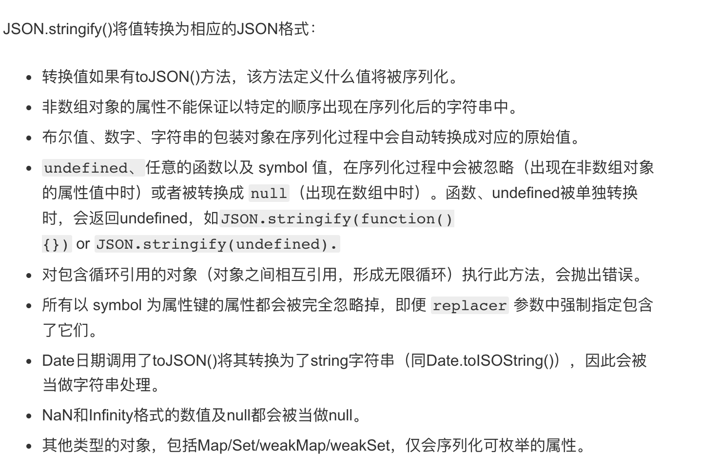

>引言

恶补我惨不忍睹的js基础，从毫无头绪到有一点头绪，画个圈希望能逐渐找到适合我的方法。目前在跟着犀牛书一章一章的过，把难点和看不懂的地方拎出来网上多找些文章看一看，相关的面试题目做一做。

第一篇先从永远很混乱，永远以为清楚了但其实还是不清楚的隐式类型转换开始，本篇对标犀牛书第6版**3.6**包装对象，**3.8** 类型变换 ，第**4**章表达式和运算符。

### 类型概述
既然要做类型转换，首先要了解js中有6大原始类型 （ES10中新增第7种bigInt 目前绝大部分生产环境还是ES6, 暂且忽略），包括`Bool` `String` `Number` `Null` `Undefined` `Symbol`(ES6新增的)和引用类型`Object`，包括`Array`，`Function`，`Regexp`，`Date`等，这篇文章中暂没考虑Symbol类型。

原始类型的判断可以使用typeof, 例如 `typeof 'aabb' === 'string'`
引用类型的判断可以使用instanceof, 例如 `[] instanceof Array === true`

注意以下两个特殊情况

``` 
 typeof null === 'object';
 typeof function(){} === 'function'
```

###类型转换规则

​	已知js数据类型有两大类，原始类型和引用类型，则类型转换无非原始类型之间的转换、原始类型转引用类型、引用类型转原始类型。

​	犀牛书中已经列出了各种类型转换对应的规则：



####原始类型的互换

原始类型的转换很简单，对应表格就行，注意红框中几种看似简单但是容易混淆的转换：

1. undefined 转数字为NaN;
2. null转数字为0；
3. true值转字符串为“true”;
4. false值转字符串为“false“


####引用类型和原始类型的互换

引用类型和原始类型的互换就是常说的装箱和拆箱的概念，装箱即把原始类型转换为对应的引用类型，拆箱即把引用类型转换为原始类型。

装箱经常发生在后面所说的常见场景中的属性访问表达式，比如说：

```javascript
var o = {x: 1, y: 2};
var arr = [1, 2, 3];
o.x //访问对象o的x属性
arr[0] //访问数组arr的索引为0的元素
```

如果`.`或`[`之前的表达式不是对象或数组，js会将其转换为对象，这也是为什么虽然原始类型不能扩展属性和方法但我们仍然能直接使用类似`str.substring()`调用方法。这个过程中实际发生了以下几个步骤：

- 将字符串`str`通过调用new String(str)的方法创建一个实例
- 在实例上调用`substring`方法
- 销毁实例

同字符串一样，数字和布尔值也有对应的方法：`Number()`、`Bool()`， **null和undefined则没有包装对象，访问它们的属性会抛出一个类型错误**。


#####引用类型转化为原始类型

引用类型到原始值的转换则比较复杂，犀牛书说的有点绕且可能是由于翻译的原因表达上略有歧义，使我理解上走了不少弯路，总的来说符合以下规则：

- 对象转换为字符串：
  1. 先尝试调用对象的toString()方法，如果对象拥有这个方法且返回一个原始值，js将这个值转换为字符串并返回这个字符串结果；
  2. 如果对象没有toString()方法，或这个方法并不返回一个原始值，则调用valueOf()方法，如果这个方法存在且返回值是一个原始值，js将这个值转换为字符串并返回这个字符串结果；
  3. 否则，抛出一个类型错误异常

- 对象转换为数字：
  1. 先尝试调用对象的valueOf()方法，如果对象拥有这个方法且返回一个原始值，js*将这个值转换为数字（需要的话）*并返回这个数字；
  2. 如果对象没有valueOf()方法，或这个方法并不返回一个原始值，则调用toString()方法，如果这个方法存在且返回值是一个原始值，js将这个值转换为数字（如果需要的话）并返回；
  3. 否则，抛出一个类型错误异常

- 对象转换为布尔值： 恒为真值

或许你已经注意到对象转数字规则中的，”如果需要的话“这个注释，先不用管它，假设js是永远需要的，后面会说到是在什么情况下不需要。


### 隐式转换的常见场景

既然明确了转化类型目标以后的规则已经明确了，那么js在做隐式转换时都是从自身类型到那种类型呢？ 这才是本文的重点，也是我经常迷惑的问题。

我整理了几种js发生隐式转化的常见场景，之后若有发现再做补充： 

1. 各种表达式中，包括算数表达式、比较表达式、逻辑表达式；
2. if()语句中，若条件是单个变量，会将单个变量转换为bool值；
3. 属性访问表达式：o.x、  arr[0]；

第2种场景很简单，如果if条件语句中只有单个变量的时候，会将变量转换为bool值，如果是表达式则先计算表达式结果再转换为bool值，第三种场景则是上文提到的装箱，也不必再说，接下来只具体介绍一下第一种场景。

#### 算术表达式

基本的算术运算符包括二元算术运算符`+、-、*、/、%`和一元算术运算符`+、-、++、--`，二元加法运算符比较复杂，随后单独讲，其余的几种都很简单，即将操作数转化为数字，所有无法转化为数字的都转化为NaN，且操作结果也是NaN， 这里注意一下一元`+`运算符即可，平时用的很少，但一些复杂的面试题中可能会出现，只要把操作数转化为数字即可。

> 这里有两个额外的tips：
>
> - 求余操作符的结果的符号和第一个操作数保持一致，eg：`5%2 == 1` `5%-2 == 1` `-5%2 == -1`
> - 一元自增自减运算符要求操作数为一个左值，左值并非是在左边的值而是指变量、对象属性或数组元素，否则会抛出一个错误
> - 

##### 二元`+`运算符

二元加法运算符的复杂之处在于既能对两个数字做加法，也能做字符串连接，行为表现为：

1. 如果其中一个操作数是对象，则遵循上面提到的对象转为原始值规则转换为原始值，其中又遵循两点规则：
   - 绝大多数对象遵循对象转换为数字的规则，即先尝试valueOf再调用toString
   - 日期对象类型到原始值的转换是使用对象到字符串的转换，即先尝试toString再调用valueOf
   - **这里的转换并不会真的将对象强制转换为数字或字符串，而是使用按转换规则处理后得到的原始值，例如对象转数字规则，如果调用toString方法后返回了字符串原始类型则不会再转为数字类型返回**

2. 如果其中一个操作数是字符串的话，另一个操作数也会转化为字符串然后进行字符串拼接；
3. 否则两个操作数都转化为数字（或NaN），然后做加法


#### 关系表达式

关系运算符包括`==、===、!=、!==、>、<、>=、<=`等，首先要知道严格相等运算符`===`和不严格相等运算符`!==`是不会做类型转换的，我们只看列出来的其余几种关系运算符。如果两个操作数的类型不同，这几种关系表达式的行为表现如下：

1. `null == null`、`undefined == undefined`、`null == undefined`，除此之外，`undefined`和`null`与其他任何结果的比较值都为false;
2. `NaN`和其他任何类型比较永远返回`false`(包括和他自己)，`NaN == NaN //false`

3. 如果一个操作数是字符串，一个操作数是数字，先将字符串转换为数字；
4. 如果其中一个操作数是`bool`值，先将其转换为数字；
5. 如果一个操作数是对象，另一个是数字或字符串，则遵循上面提到的对象转为原始值规则转换为原始值再进行比较，这里的转换和二元`+`运算符一样，符合：
   - 绝大多数对象遵循对象转换为数字的规则，即先尝试valueOf再调用toString
   - 日期对象类型到原始值的转换是使用对象到字符串的转换，即先尝试toString再调用valueOf
   - **这里的转换并不会真的将对象强制转换为数字或字符串，而是使用按转换规则处理后得到的原始值，例如对象转数字规则，如果调用toString方法后返回了字符串原始类型则不会再转为数字类型返回**
6. 其他不同类型之间的比较均不相等

**总结**：关系表达式优先把操作数转化为数字，包括对象，只是对象转化为数字时直接使用返回的结果并不强制转化为数字，`Date`对象除外；

> 这里也有几个额外的tips:
>
> - 0 == -0 //true
> - 所以大写的ASCII字母都小于小写的ASCII字母，所以在进行字符串比较的时候注意做大小写转换，eg: `'Zore' > 'area' // false`
> - null === undefined //false  但 null == undefined //true
> - `<=`和`>=`运算符只是简单的不大于和不小于，它们在判断相等的时候并不依赖`==`或`===`运算符的比较规则
> - 


#### 其他表达式

其他表达式包括逻辑表达式、复制表达式和一些未提到的运算符等，在隐式类型转换中我们不用太关心，因为他们的转换会比较明确，其中我们只需要知道：

1. 逻辑与`&&`，逻辑或`||`是会在特定情况下短路的，即只计算左边的表达式不计算右边的表达式；
2. 赋值表达式是从右向左结合的；
3. 基本的运算优先级

以注意一些具有副作用的运算的考察即可，eg: `var i = 1; false && i++;`这里的i++表达式并没有被计算，除此之外，逻辑非运算符`!`会将操作数的布尔值求反，可以用两次逻辑非运算`!!`来得到一个操作数的布尔值。


###总结

js的类型转换的表现满足以下几点规则：

1. null == null`、`undefined == undefined`、`null == undefined`，除此之外，`undefined`和`null`与其他任何结果的比较值都为false;
2. NaN`和其他任何类型比较永远返回`false`(包括和他自己)，`NaN == NaN //false`
3. +、==、!=和关系运算中，如果其中一个操作数是对象，执行对象到原始值转换
4. 对象到原始值的转换基本都使用对象到数字的转换规则即先尝试valueOf再调用toString;
5. 在第二点的基础上日期对象类型到原始值的转换是使用对象到字符串的转换，即先尝试toString再调用valueOf;
6. **+、==、!=和关系运算中的转换并不会真的将对象强制转换为数字或字符串，而是使用按转换规则处理后得到的原始值**（这就是上面提到的不需要的情况），例如对象转数字规则，如果调用toString方法后返回了字符串原始类型则不会再转为数字类型返回； 
7. 加号运算符和比较运算符的行为有所不同，前者更偏爱字符串，后者更偏爱数字。


这篇总结就到这里了，对我来说已经比较明晰了，希望对你们来说也有所帮助。


### 面试题练习

先看几道题目，可以先做完再看后面的解析（部分来源于参考文章）：


```tex
1. [1,2] + 1
2. [1,2] - 1
3. [1,2] + [3,4]
4. true + false
5. "number" + 15 + 3
6. 15 + 3 + "number"
7. "foo" + + "bar"
8. "true" == true
9. false == "false"
10. !!"false" == !!"true"
11. ["x"] == "x"
12. [] + null + 1
13. [1,2,3] == [1,2,3]
14. [] + {}
15. {} + []
16. {} + [] + {} + [1]
17. ! + [] + [] + ![]
18. 所有的假值包括哪些？
19. 将一个变量强制转换为字符串，你能说几种方法？它们有什么优缺点？
20. 什么样的处理可以让`a == 1 && a == 2 && a == 3`表达式为`true`?
```


------


**解析**：

1. ”1,21“  

   根据加法运算规则，对象转换为原始类型，`[1,2]`先调用`valueOf()`得到它本身，还是一个引用类型于是继续调用`toString()`得到`”1,2“`**直接使用**，再根据规则字符串与数字相加，数字转换为字符串做字符串相连

2. NaN

   根据减法运算规则，操作数直接转化为数字，对象转数字且将`toString()`的返回值强制转化为数字即`NaN`，`NaN - 1` 还是`NaN`

3. "1,23,4"

   对象转原始类型且`toString()`的返回值直接使用，字符串拼接得到`”1，23，4“`

4. 1

   没有引用类型，没有字符串，操作数转数字相加

5. ”number153“

   表达式从左向右执行

6. ”18number“

   考察点同上

7. ”fooNaN“

   表达式会解析成`”foo“ + ( + "bar" )`，根据一元`+`运算符，操作数转数字得到`NaN`，`”foo“ + NaN`将`NaN`转字符串做字符串拼接，注意加号之间的空格，如果无空格就是自增运算符了

8. false

   `==`优先转数字，其中一个操作符是布尔值，先转为数字得到` ”true“ == 1`，其中一个操作数是字符串，另一个是数字，先将字符串转换为数字得到 `NaN == 1` 即`false`

9. false

   考点同上

10. true

    逻辑非运算符的优先级比关系运算符的优先级高，两个操作数会先被转换为布尔值即` true == true`，显然表达式结果为`true`

11. true

    其中一个操作数是对象，按规则转化为原始值，且`toString()`的返回值直接使用`"x" == "x"`显然成立

12. ”null1“

    表达式从左往右执行，`[] + null`，对象转原始值得到`”“`，连续做字符串拼接得到`”null1“`

13. false

    引用类型比较的是内存地址

14. "[object Object]"

    14,15题放一起看，`[] + {}`` []`先转原始值为`”“`，`{}`转原始值为`"[object Object]"`

15. 0

    这里有些意外，这涉及到JavaScript的语法解析规则，在这段代码中，解析器遇到{}后将其解析为了一个空的代码块，直接忽略，于是表达式被解析为`+ []`，根据一元操作符`+`，`[]`转数字为0

16. ”0[object Object]1“

    是14，15的考点结合的升级版

17. "truefalse"

    根据运算符的优先级表达式解析为`!(+[]) + [] + (![])`，即`!0 + [] + false` 即` true + [] + false` 即`true + "" + false`

18. 所有的假值包括

    ```javascript
    undefined
    null
    NaN
    0
    -0
    ""
    false
    //还有一种特殊的假值对象
    document.all;    //输出当前文档下的所有标签
    Object.prototype.toString.call(document.all);    //[object HTMLAllCollection]
    typeof document.all;      //undefined
    Boolean(document.all);    //false,意外吧？！！！
    
    ```

19. 假设变量为str，将变量强制转换为字符串有以下几种方法：

    - new String(str)

    - toString

      ```javascript
      if(str.toString()) str.toString() 
      else Object.prototype.toString.call(str)
      ```

    - str + ""

    - JSON.stringfy(str)

    第一种最为稳妥，第二种如果对象重写了`toString`方法则会影响最终的结果，第三种方法，根据对象转原始值的规则，是先尝试调用`valueOf`再调用`toString()`，如果对象重写了自身的`valueOf`方法或`toString()`方法则会影响到最终的结果，第四种方法，如果传入的值本身就是字符串会得到双重引号的值，eg: `JSON.stringify("11")`得到`”“11”“`，另外如果对象内有递归引用，还会抛出报错，eg：

    ```javascript
    var a = {},b = {};
    a.param = b;
    b.param = a;
    JSON.stringify(a);
    //VM14994:4 Uncaught TypeError: Converting circular structure to JSON
    ```

    除此之外

    [MDN]: https://developer.mozilla.org/zh-CN/docs/Web/JavaScript/Reference/Global_Objects/JSON/stringify

    还给出了以下提醒：

    

20. 根据对象转换为原始值的规则，可以这样写：

    ```javascript
    var a = {
      value: [3, 2, 1],
      valueOf: function() { return this.value },
      toString: function() {return this.value.pop()}
    }
    ```


------


### 参考

[【JS 进阶】你真的掌握变量和类型了吗]: https://juejin.im/post/5cec1bcff265da1b8f1aa08f#heading-28
[17道题彻底理解 JavaScript 中的类型转换]: https://juejin.im/post/5d4999fff265da038f47f5c7#heading-6
[关于数据类型转换的面试题总结]: https://zhuanlan.zhihu.com/p/31105614

